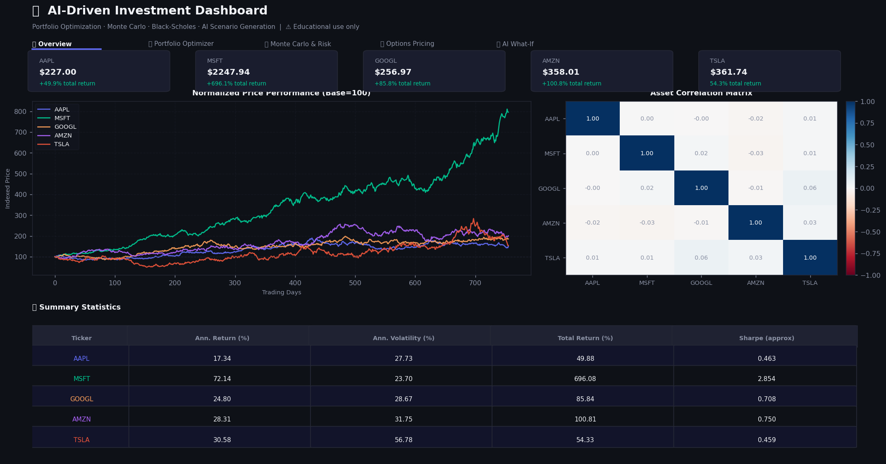
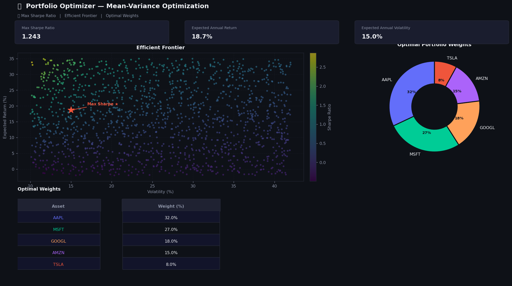
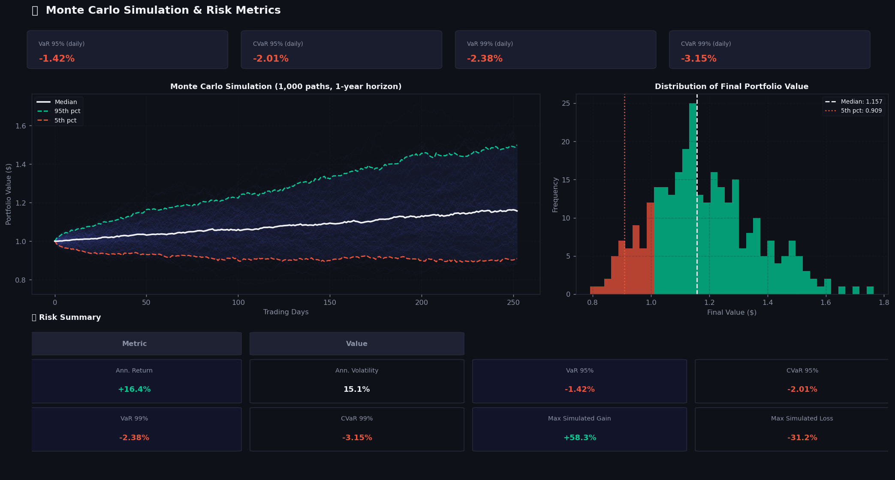
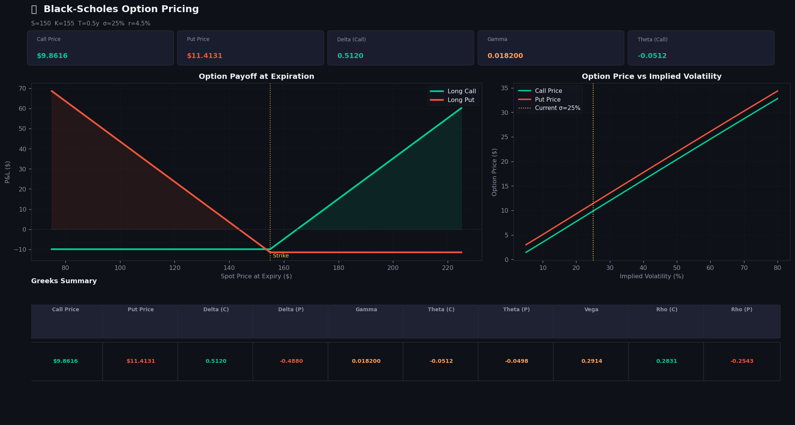
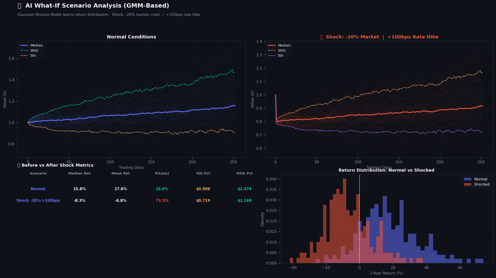
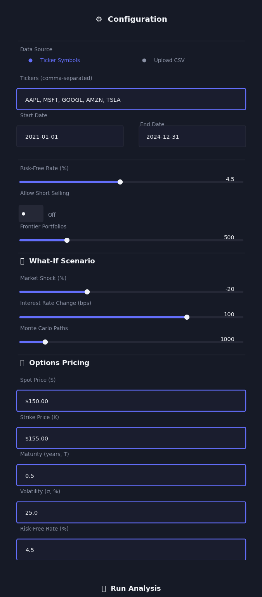

# 📈 AI-Driven Investment Dashboard

> **⚠️ Disclaimer**: This project is for **educational and simulation purposes only**. It does not constitute financial advice. Backtest results and simulated outcomes do not guarantee future performance. Always consult a qualified financial professional before making investment decisions.

[](https://python.org)
[](https://streamlit.io)
[](LICENSE)
[](https://github.com/ranaroussi/yfinance)

A comprehensive, interactive financial analytics dashboard combining **portfolio optimization**, **Black-Scholes option pricing**, **Monte Carlo simulations**, and **AI-driven what-if scenario generation** powered by Gaussian Mixture Models.

---

## 🖼️ Screenshots

### 1 · Dashboard Overview — Normalized Price Performance & Correlation Heatmap



*The **Overview** tab displays per-ticker KPI cards, a multi-asset normalized price chart (base=100), an annotated correlation heatmap, and a full summary statistics table with annualized return, volatility, and Sharpe ratios.*

---

### 2 · Portfolio Optimizer — Efficient Frontier & Optimal Weights



*The **Optimizer** tab runs up to 2,000 random portfolios using `scipy.optimize` SLSQP with 50 random starts to locate the Max-Sharpe portfolio (red star). The donut chart shows the resulting allocation; the sortable weights table lists each asset's optimal fraction.*

---

### 3 · Monte Carlo Simulation — Price Paths & VaR/CVaR



*The **Monte Carlo** tab simulates up to 5,000 portfolio paths over a 1-year horizon with 5th/median/95th percentile bands. The histogram shows the distribution of final portfolio values. The risk table reports VaR and CVaR at both 95% and 99% confidence levels.*

---

### 4 · Black-Scholes Options Pricing — Payoff Diagram & Greeks



*The **Options** tab computes full closed-form Black-Scholes prices and all Greeks (Δ, Γ, Θ, ν, ρ). The payoff diagram shows P&L at expiry for both long call and long put. The vol surface chart reveals price sensitivity across 5%–80% implied volatility.*

---

### 5 · AI What-If Scenarios — GMM-Based Shock Analysis



*The **AI What-If** tab fits a 3-component Gaussian Mixture Model to capture market regimes, then generates synthetic paths for both normal and shocked conditions. The distribution overlay and Before/After table quantify the shift in probability of loss and percentile outcomes.*

---

### 6 · Sidebar Configuration



*The sidebar provides complete control: ticker symbols or CSV upload, date range, risk-free rate, short-selling toggle, Monte Carlo path count, market shock %, rate hike in bps, and all Black-Scholes inputs.*

---

## ✨ Features

| Module | Description |
|--------|-------------|
| **Data Loading** | Fetch prices via `yfinance` for any stock/ETF/commodity, or upload CSV |
| **Portfolio Optimizer** | Markowitz mean-variance; Max-Sharpe via `scipy.optimize` (50 random starts) |
| **Efficient Frontier** | Up to 2,000 random portfolios as Viridis scatter colored by Sharpe ratio |
| **Monte Carlo** | Parametric MC, up to 5,000 paths, 252-day horizon, percentile bands |
| **VaR & CVaR** | Historical Value-at-Risk and Conditional VaR at 95% and 99% |
| **Black-Scholes** | Full option pricing + all Greeks; payoff diagram + vol sensitivity chart |
| **AI Scenarios** | 3-component GMM fitted to historical returns; synthetic paths under user shocks |
| **Risk Metrics** | Before/After comparison: probability of loss, percentile outcomes, median return |

---

## 🏗️ Project Structure

```
ai-investment-dashboard/
├── app.py                      # Main Streamlit application (5 tabs)
├── requirements.txt
├── README.md
├── .gitignore
├── assets/
│   └── screenshots/
│       ├── 01_overview.png
│       ├── 02_efficient_frontier.png
│       ├── 03_monte_carlo.png
│       ├── 04_options_pricing.png
│       ├── 05_what_if_scenarios.png
│       └── 06_sidebar.png
├── src/
│   ├── __init__.py
│   ├── data_loader.py          # yfinance fetching + CSV upload
│   ├── optimizer.py            # Mean-variance optimization, efficient frontier
│   ├── models.py               # Black-Scholes, Monte Carlo, VaR, GMM scenarios
│   └── utils.py                # Plotly chart builders + formatting helpers
├── notebooks/
│   └── 01_model_exploration.ipynb
└── data/
```

---

## 🚀 Installation

### Using `venv` + pip

```bash
git clone https://github.com/yourusername/ai-investment-dashboard.git
cd ai-investment-dashboard

python -m venv .venv
source .venv/bin/activate       # macOS/Linux
# .venv\Scripts\activate        # Windows

pip install -r requirements.txt
streamlit run app.py
```

### Using Poetry

```bash
poetry install
poetry run streamlit run app.py
```

Opens at **http://localhost:8501**.

---

## 📖 Usage

1. **Enter tickers** in the sidebar (e.g. `AAPL, MSFT, GOOGL, TSLA`) or upload a CSV
2. **Set date range** and **risk-free rate**
3. Optionally enable **short selling** and adjust **Monte Carlo paths**
4. Configure the **What-If scenario** (market shock % and rate hike in bps)
5. Set **Black-Scholes** parameters (spot, strike, maturity, volatility)
6. Click **🚀 Run Analysis**

### CSV Upload Format

```csv
Date,AAPL,MSFT,GOOGL
2021-01-04,129.41,219.85,1728.24
2021-01-05,131.01,226.54,1740.92
```

---

## 🧮 Model Details

**Portfolio Optimization** — Markowitz mean-variance via `scipy.optimize.minimize` (SLSQP). 50 random starting weights mitigate local optima. Constraints: weights sum to 1; optionally bounded [0, 1] for no-short constraint.

**Black-Scholes** — Full closed-form solution with Delta, Gamma, Theta (per calendar day), Vega (per 1% vol change), and Rho (per 1% rate change).

**Monte Carlo** — Parametric simulation using historical mean and standard deviation of portfolio returns. Up to 5,000 paths over a 252-day horizon.

**GMM Scenarios** — A 3-component Gaussian Mixture Model is fitted to historical daily returns, capturing regime-switching behaviour (calm markets, volatile periods, crisis regimes). Synthetic paths are drawn from this GMM; shocked scenarios apply a one-time price change on Day 1 and adjust daily drift for the rate hike.

---

## 💡 Suggested Improvements

1. **Authentication** — Add `streamlit-authenticator` for multi-user deployments
2. **Deploy** — One-click to [Streamlit Community Cloud](https://streamlit.io/cloud)
3. **More APIs** — Alpha Vantage (fundamentals), FRED (macro data), Quandl (commodities)
4. **LSTM / Transformer** — Replace parametric MC with deep-learning price paths
5. **RL Optimization** — Use RL agents for dynamic portfolio rebalancing
6. **Factor Models** — Fama-French 3/5-factor decomposition
7. **American Options** — Trinomial tree pricing

---

## 📋 Requirements

```
streamlit>=1.32.0
yfinance>=0.2.38
pandas>=2.2.0
numpy>=1.26.0
plotly>=5.20.0
scipy>=1.13.0
scikit-learn>=1.4.0
statsmodels>=0.14.1
```

---

## 📄 License

**MIT License** — see [LICENSE](LICENSE) for details.
