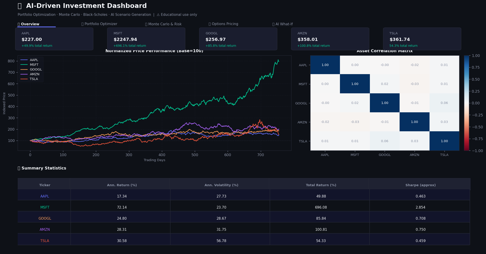
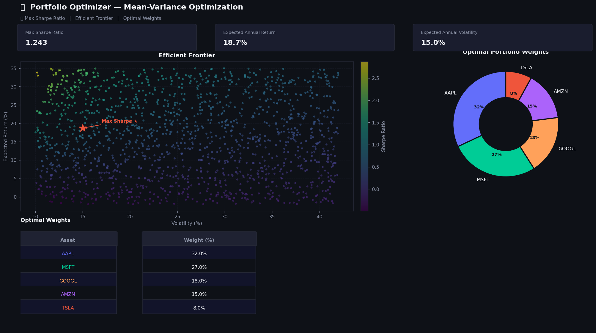
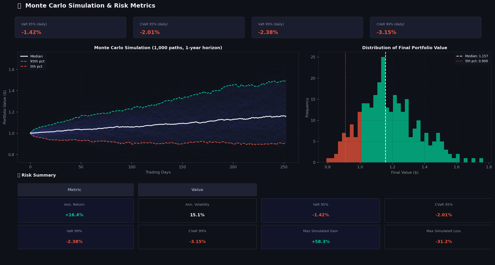
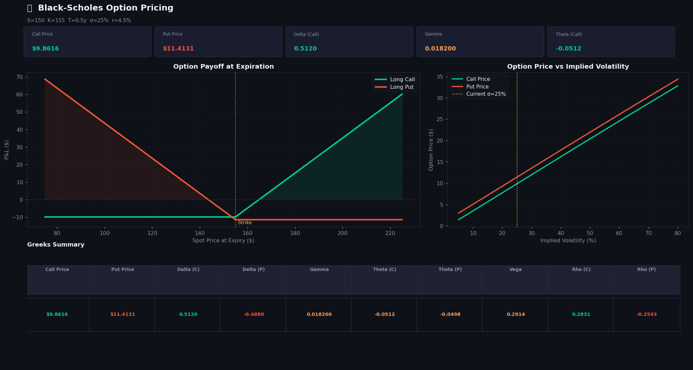
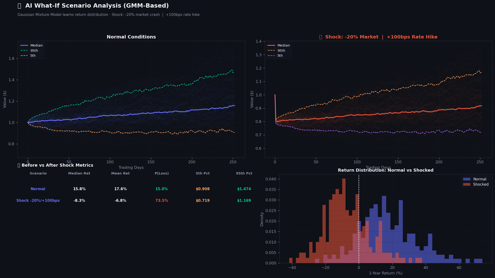

# AI-Driven Investment Dashboard

## For a data analyst application

**Do not lead a resume with this title.** The word “AI” here is scenario math (Monte Carlo, options, a frontier), not a language model. Keep it as a finance-dashboard extra behind Advanced Financial Models.

An interactive financial-analytics application combining market-data exploration, portfolio optimization, Monte Carlo simulation, Black–Scholes option pricing, and Gaussian-mixture scenario analysis. There is no language model in this repository.

## Capabilities

| Area | What the application provides |
|---|---|
| Market overview | Normalized prices, returns, correlations, and descriptive statistics |
| Portfolio optimization | In-sample minimum-variance frontier and maximum-Sharpe weights. The mean and covariance are fit on the same window the chart reports. The return is an arithmetic mean (mean × 252), not a CAGR |
| Walk-forward check | Max-Sharpe versus equal weight. Trailing 252 trading days when the sample is longer than that, otherwise 63 (the file needs at least 65 returns). Rebalance every 21 trading days. Weights earn the next day's return. 5 bps commission plus 5 bps slippage on purchases and on sales |
| Monte Carlo | Seeded paths that resample the in-sample portfolio's daily mean and volatility. Not an out-of-sample forecast |
| Options | Black–Scholes prices and Greeks (vega and rho per 1 percentage point, theta per calendar day). The volatility chart is the pricing input, not an implied-volatility solve |
| Scenario analysis | Gaussian-mixture paths fit on that same in-sample series. A positive rate input is subtracted from each daily draw (annual decimal / 252). The market shock is added once, on day 1 |
| Reporting | Interactive Plotly charts and decision-oriented KPI cards |

The screenshots show the overview, in-sample frontier, Monte Carlo, options, and scenarios. The walk-forward panel sits on the optimizer tab and is not in those images.

## Application Preview

### Market Overview

### Efficient Frontier

### Monte Carlo Simulation

### Options Pricing

### What-If Scenarios

## Architecture

~~~text
Market Data
    ↓
Data Loader → Analytics & Risk Metrics
    ↓                    ↓
Optimizer           Scenario Models
    ↓                    ↓
       Streamlit + Plotly Dashboard
~~~

## Run Locally

~~~bash
git clone https://github.com/ParBproject/AI-Investment-Dashboard.git
cd AI-Investment-Dashboard

python -m venv .venv
source .venv/bin/activate
pip install -r requirements.txt
streamlit run app.py
~~~

Requires Python 3.12 or newer (`scipy` 1.18 does not install on 3.11). `requirements.txt` pins the libraries the tests were run against. Matplotlib is included for `notebooks/01_model_exploration.ipynb`.

Open http://localhost:8501.

## Repository Structure

~~~text
AI-Investment-Dashboard/
├── app.py
├── src/
│   ├── data_loader.py
│   ├── models.py
│   ├── optimizer.py
│   └── utils.py
├── notebooks/01_model_exploration.ipynb
├── tests/
├── assets/screenshots/
├── .github/workflows/ci.yml
└── requirements.txt
~~~

## Skills Demonstrated

Python, pandas, NumPy, SciPy, scikit-learn, financial modelling, portfolio optimization, Monte Carlo methods, option pricing, scenario analysis, Streamlit, Plotly, and modular application design.

## Responsible Use

This project is for educational and simulation purposes and is not financial advice. Historical and simulated results do not guarantee future performance. Production use would require validated data, model governance, monitoring, security controls, and professional risk review.
